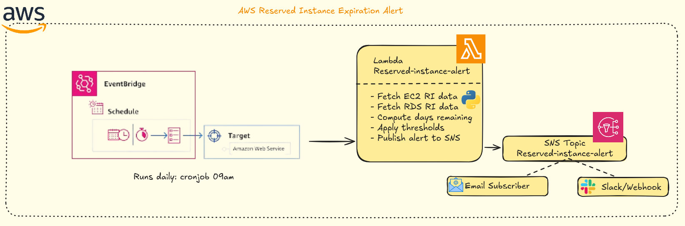

<div align="center">
  


## Automated Reserved Instance (EC2/RDS) Expiration Alerts

**Updated: January 14, 2026**

[](https://github.com/nicoleepaixao)
[](https://github.com/nicoleepaixao/aws-ri-expiration-alert)
[](https://nicoleepaixao.medium.com/)

<p align="center">
  <a href="README-PT.md">🇧🇷</a>
  <a href="README.md">🇺🇸</a>
</p>

</div>

---

<p align="center">
  
</p>

## **Overview**

This project implements a fully serverless, low-cost FinOps automation that monitors AWS Reserved Instances (EC2 and RDS) and sends alerts when they are approaching their expiration date. The system runs daily via AWS Lambda + EventBridge + SNS, evaluating RI expiration thresholds and notifying your team to prevent unexpected cost increases.

---

## **How It Works**

### **Execution Flow**

1. **EventBridge Trigger:** Scheduled rule triggers the Lambda function daily
2. **Data Collection:** Lambda queries all active EC2 and RDS Reserved Instances
3. **Expiration Calculation:** Computes days remaining until expiration
4. **Threshold Evaluation:** Checks against configured alert thresholds (60, 30, 7 days)
5. **Alert Generation:** Builds notification message with RI details
6. **SNS Publication:** Sends alerts to all registered subscribers
7. **Team Notification:** Teams receive advance notice and can renew on time

---

## **Available Components**

<div align="center">

| **Component** | **Technology** | **Purpose** |
|:-------------:|:--------------:|:-----------:|
| **Lambda** | Python 3.12 | Core alert logic and RI scanning |
| **EventBridge** | Cron Schedule | Daily automated execution |
| **SNS** | Topic + Subscriptions | Multi-channel notifications |
| **IAM** | Least-privilege Role | Secure Lambda execution |

</div>

---

## **Setup Instructions**

### **1. Create SNS Topic**

1. **Navigate to SNS Console:** Open AWS SNS in your region
2. **Create Topic:** Name it `reserved-instance-alert`
3. **Add Subscribers:** Configure email, Slack webhook, or SMS
4. **Confirm Subscriptions:** Verify all subscribers accept the subscription

**Note:** Save the SNS Topic ARN for Lambda configuration.

---

### **2. Create IAM Role**

Create an IAM role with the following permissions:

```json
{
  "Version": "2012-10-17",
  "Statement": [
    {
      "Effect": "Allow",
      "Action": [
        "ec2:DescribeReservedInstances",
        "rds:DescribeReservedDBInstances",
        "sns:Publish",
        "logs:CreateLogGroup",
        "logs:CreateLogStream",
        "logs:PutLogEvents"
      ],
      "Resource": "*"
    }
  ]
}
```

**Trust Policy:**

```json
{
  "Version": "2012-10-17",
  "Statement": [
    {
      "Effect": "Allow",
      "Principal": {
        "Service": "lambda.amazonaws.com"
      },
      "Action": "sts:AssumeRole"
    }
  ]
}
```

---

### **3. Deploy Lambda Function**

1. **Create Function:**
   - Name: `reserved-instance-alert`
   - Runtime: Python 3.12
   - Handler: `lambda_function.lambda_handler`
   - Role: Select the IAM role created in step 2

2. **Upload Code:** Copy the Lambda script from this repository

3. **Configure Environment Variables:**

| **Variable** | **Description** | **Example** |
|--------------|-----------------|-------------|
| `SNS_TOPIC_ARN` | ARN of SNS topic | `arn:aws:sns:us-east-1:123456789012:reserved-instance-alert` |
| `REGION` | AWS region | `us-east-1` |
| `THRESHOLD_DAYS` | Alert thresholds | `60,30,7` |

4. **Test Function:** Invoke manually to verify alerts are sent

---

### **4. Create EventBridge Rule**

1. **Navigate to EventBridge:** Open EventBridge Rules
2. **Create Rule:**
   - Name: `ri-expiration-daily-check`
   - Rule type: Schedule
   - Cron expression: `cron(0 12 * * ? *)`
     - Runs every day at 12:00 UTC
3. **Select Target:** Choose the Lambda function created in step 3
4. **Activate Rule:** Enable the schedule

---

## **Configuration**

### **Environment Variables**

| **Variable** | **Description** | **Default** |
|--------------|-----------------|-------------|
| `SNS_TOPIC_ARN` | ARN of the SNS topic for notifications | Required |
| `REGION` | AWS region to scan | `us-east-1` |
| `THRESHOLD_DAYS` | Comma-separated alert thresholds | `60,30,7` |

### **Example Alert Message**

```text
Reserved Instance Expiration Alert

The following reservations are approaching expiration:

━━━━━━━━━━━━━━━━━━━━━━━━━━━━━━━━━━━━━━━━

Service: EC2
Instance Type: m5.large
Reservation ID: abc123
Expires in: 29 days
End Date: 2025-01-12T00:00:00Z

━━━━━━━━━━━━━━━━━━━━━━━━━━━━━━━━━━━━━━━━

Service: RDS
Instance Type: db.m5.large
Reservation ID: rds-resv-889
Expires in: 37 days
End Date: 2025-01-20T00:00:00Z

━━━━━━━━━━━━━━━━━━━━━━━━━━━━━━━━━━━━━━━━

Action Required: Review and renew these reservations to maintain cost savings.
```

---

## **Project Structure**

```text
.
├── lambda_function.py         # Main Lambda handler
├── requirements.txt           # Python dependencies (boto3)
├── iam_policy.json           # IAM role permissions
├── README.md                 # Project documentation
└── .gitignore               # Ignored files
```

---

## **Additional Information**

For more details about AWS Reserved Instances, cost optimization, and FinOps best practices, refer to:

- [AWS Reserved Instances Documentation](https://aws.amazon.com/ec2/pricing/reserved-instances/) - Official EC2 RI guide
- [AWS FinOps Best Practices](https://aws.amazon.com/aws-cost-management/aws-cost-optimization/) - Cost optimization strategies
- [Boto3 EC2 Documentation](https://boto3.amazonaws.com/v1/documentation/api/latest/reference/services/ec2.html) - Python SDK reference
- [Boto3 RDS Documentation](https://boto3.amazonaws.com/v1/documentation/api/latest/reference/services/rds.html) - RDS API reference

---

## **Connect & Follow**

Stay updated with AWS cost optimization strategies and FinOps automation:

<div align="center">

[](https://github.com/nicoleepaixao)
[](https://www.linkedin.com/in/nicolepaixao/)
[](https://medium.com/@nicoleepaixao)

</div>

---

## **Disclaimer**

This tool is provided as-is for monitoring and alerting purposes. AWS Reserved Instance pricing, availability, and policies may change. Always verify reservation details in the AWS Console and refer to official AWS documentation for the most current information. Test thoroughly in non-production environments before deploying.

---

<div align="center">

**Happy optimizing your AWS costs!**

*Document Created: December 2, 2025*

Made with ❤️ by [Nicole Paixão](https://github.com/nicoleepaixao)

</div>
